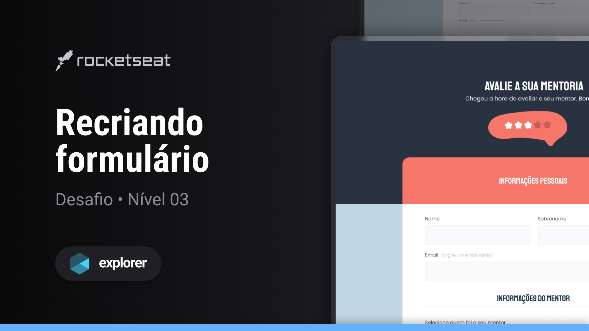
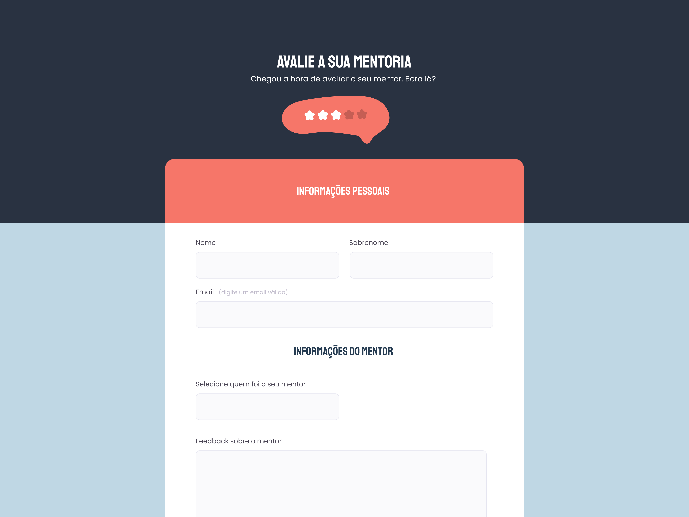

## Sobre o desafio Extra

Este desafio envolve a criação de uma interface web simples, 
desenvolvida como parte da trilha Explorer da Rocketseat. 
O objetivo principal é praticar os conceitos fundamentais dos diversos tipos de campos HTML utilizados em formulários. 
Durante este desafio de projeto, foram abordados os seguintes conceitos:

Conceitos aplicados
* Estruturação semântica com HTML e CSS
* Uso da ferramenta Figma
* Aplicação de fontes e cores personalizadas nos projetos
* Posicionamento e espaçamento de elementos utilizando os conceitos de Box Model e Flexbox do CSS

 ## Tecnologias
- HTML
- CSS
- Figma

  
## Layout do desafio
<table>
  <tr>
    <td></td>
  </tr>   
</table>

## Demonstração
Aqui está uma prévia do resultado final do projeto desenvolvido
[Link Demonstração](https://rs-ferreira.github.io/FormAvalieSuaMentoria/)

## Contato
Se você tiver alguma dúvida ou quiser entrar em contato, você pode me enviar uma mensagem pelo
[LinkedIn](https://www.linkedin.com/in/ronaldosf).

<a href="#readme-top">voltar ao topo</a>

